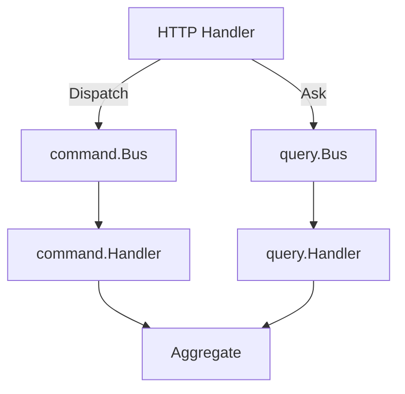

# Application Layer

## Overview

The application layer implements **CQRS** — it splits the write path (commands) from the read path (queries).
It orchestrates domain objects and infrastructure but contains no business rules itself.

## Contents

- [Command Bus](commands.md) — `internal/application/command/bus.go`
- [Query Bus](queries.md) — `internal/application/query/bus.go`
