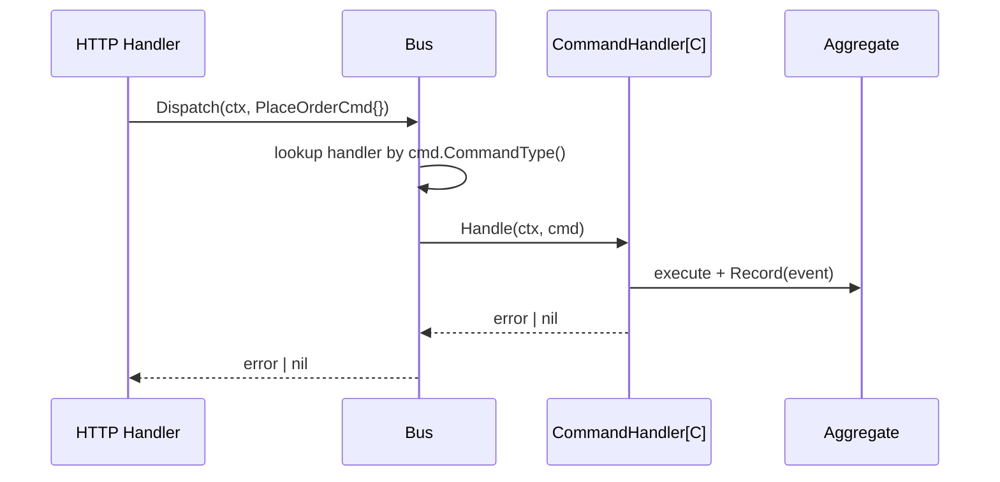

# Command Bus

**Source:** `internal/application/command/bus.go`

## Purpose

Defines the CQRS write-side contracts: `CommandType`, `Command`, `CommandHandler`, and `Bus`.
These are interfaces only — implementations are provided per bounded context.

## Types

### CommandType

```go
type CommandType string
```

A dedicated string type for command routing keys. Prevents stringly-typed mistakes at compile time.

### Command

```go
type Command interface {
    CommandType() CommandType
}
```

Marker interface. Every command struct returns its `CommandType` — used by the bus to find the correct handler.

### CommandHandler

```go
type CommandHandler[C Command] interface {
    Handle(ctx context.Context, cmd C) error
}
```

Generic, type-safe handler interface. `C` is the concrete command type.
Implementations receive a strongly-typed argument — no type assertions needed inside the handler.

### Bus

```go
type Bus interface {
    Register(commandType CommandType, handler any)
    Dispatch(ctx context.Context, cmd Command) error
}
```

- `Register` — accepts any `CommandHandler[C]` implementation; the bus adapts it internally.
- `Dispatch` — routes an incoming command to the registered handler via `cmd.CommandType()`.

#### Why "Bus" and not "Dispatcher" or "Router"?

The term **Bus** is conventional in CQRS implementations and carries a deliberate semantic hint:
a bus implies the message may travel asynchronously — across goroutines, processes, or even network boundaries (Kafka, RabbitMQ).
"Dispatcher" and "Router" suggest a direct, synchronous call, which is an implementation detail that the interface should not promise.
Using `Bus` keeps the door open to swap the in-process implementation for a message broker without changing callers.

## Flow



## Usage Pattern

```go
// 1. Define value types for IDs — avoids passing wrong string in wrong place
type OrderID string
type CustomerID string

// 2. Define a command type constant
const CmdPlaceOrder command.CommandType = "PlaceOrder"

// 3. Define a command using typed IDs
type PlaceOrderCommand struct {
    OrderID    OrderID
    CustomerID CustomerID
}
func (c PlaceOrderCommand) CommandType() command.CommandType { return CmdPlaceOrder }

// 4. Implement a type-safe handler — no casting inside
type PlaceOrderHandler struct{ store eventstore.EventStore }

func (h *PlaceOrderHandler) Handle(ctx context.Context, cmd PlaceOrderCommand) error {
    // cmd is already PlaceOrderCommand — no type assertion needed
    _ = cmd.OrderID
    _ = cmd.CustomerID
    return nil
}

// PlaceOrderHandler satisfies CommandHandler[PlaceOrderCommand]
var _ command.CommandHandler[PlaceOrderCommand] = (*PlaceOrderHandler)(nil)

// 5. Register at startup (via uber/fx)
bus.Register(CmdPlaceOrder, &PlaceOrderHandler{store: store})

// 6. Dispatch from HTTP handler
bus.Dispatch(ctx, PlaceOrderCommand{
    OrderID:    OrderID("123"),
    CustomerID: CustomerID("456"),
})
```

## See Also

- [Query Bus](queries.md) — read-side counterpart
- [Application Layer Overview](README.md)
- [Event Store](../infrastructure/eventstore.md) — typically called inside command handlers
- Implemented in [PLAN-001](../plans/plan-001-initial-setup.md)
