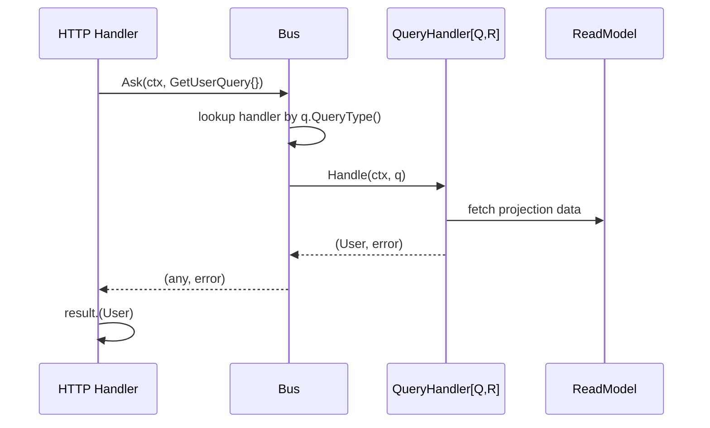

# Query Bus

**Source:** `internal/application/query/bus.go`

## Purpose

Defines the CQRS read-side contracts: `QueryType`, `Query`, `QueryHandler`, and `Bus`.
Queries never mutate state — they return data from read models (projections).

## Types

### QueryType

```go
type QueryType string
```

A dedicated string type for query routing keys. Prevents stringly-typed mistakes at compile time.

### Query

```go
type Query interface {
    QueryType() QueryType
}
```

Marker interface. Every query struct returns its `QueryType`.

### QueryHandler

```go
type QueryHandler[Q Query, R any] interface {
    Handle(ctx context.Context, q Q) (R, error)
}
```

Generic, type-safe handler interface. `Q` is the concrete query type, `R` is the result type.
Implementations receive strongly-typed arguments — no type assertions needed inside the handler.

### Bus

```go
type Bus interface {
    Register(queryType QueryType, handler any)
    Ask(ctx context.Context, q Query) (any, error)
}
```

- `Register` — accepts any `QueryHandler[Q, R]` implementation; the bus adapts it internally.
- `Ask` — routes a query to the registered handler; returns `any` that callers type-assert.

## Flow



## Usage Pattern

```go
// 1. Define value types for IDs
type UserID string

// 2. Define a query type constant
const QryGetUser query.QueryType = "GetUser"

// 3. Define a query using a typed ID
type GetUserQuery struct {
    UserID UserID
}
func (q GetUserQuery) QueryType() query.QueryType { return QryGetUser }

// 4. Define a result type
type User struct {
    ID   UserID
    Name string
}

// 5. Implement a type-safe handler — no casting inside
type GetUserHandler struct{ db *Database }

func (h *GetUserHandler) Handle(ctx context.Context, q GetUserQuery) (User, error) {
    return h.db.FindUser(ctx, q.UserID)
}

// GetUserHandler satisfies QueryHandler[GetUserQuery, User]
var _ query.QueryHandler[GetUserQuery, User] = (*GetUserHandler)(nil)

// 6. Register at startup
bus.Register(QryGetUser, &GetUserHandler{db: db})

// 7. Ask from HTTP handler
result, err := bus.Ask(ctx, GetUserQuery{UserID: UserID("123")})
user := result.(User)
```

## See Also

- [Command Bus](commands.md) — write-side counterpart
- [Application Layer Overview](README.md)
- Implemented in [PLAN-001](../plans/plan-001-initial-setup.md)
