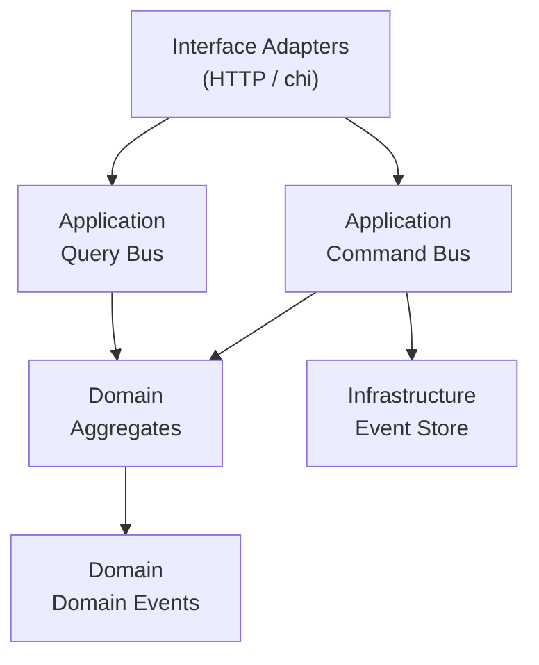
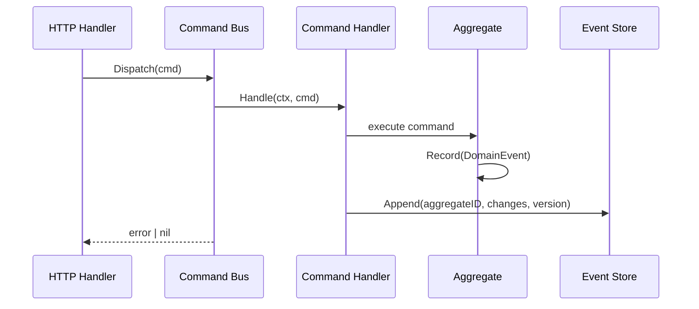
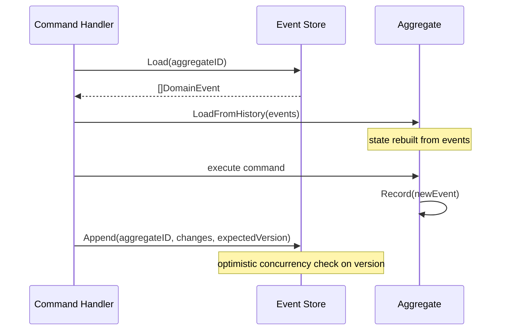
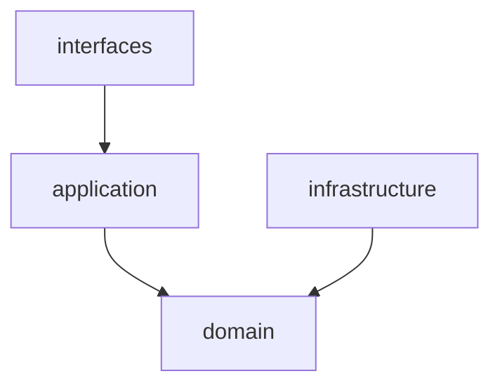

# Architecture Overview

## Summary

This project is a learning implementation of **Domain-Driven Design (DDD)** combined with **CQRS** (Command Query Responsibility Segregation) and **Event Sourcing** in Go.

The repository is a **monorepo** with three Go modules managed via `go.work`:

| Module | Path | Role |
|--------|------|------|
| `github.com/savvinovan/wallet-service` | `wallet-service/` | Wallet bounded context |
| `github.com/savvinovan/kyc-service` | `kyc-service/` | KYC bounded context |
| `github.com/savvinovan/event-sourcing-learning/contracts` | `contracts/` | Shared event schemas |

The architecture is organized into four layers with a strict dependency rule: outer layers depend on inner layers, never the reverse.

## Layer Diagram

## CQRS Flow

## Event Sourcing Flow

## Dependency Rule

The `domain` package has **zero external dependencies** — only the Go standard library.

## Architectural Decisions

See [ADR Index](decisions/README.md) for all accepted architectural decisions.

Key decisions:
- [ADR-001](decisions/adr-001-ddd-cqrs-es.md) — DDD + CQRS + Event Sourcing as core architecture
- [ADR-002](decisions/adr-002-tech-stack.md) — Technology stack
