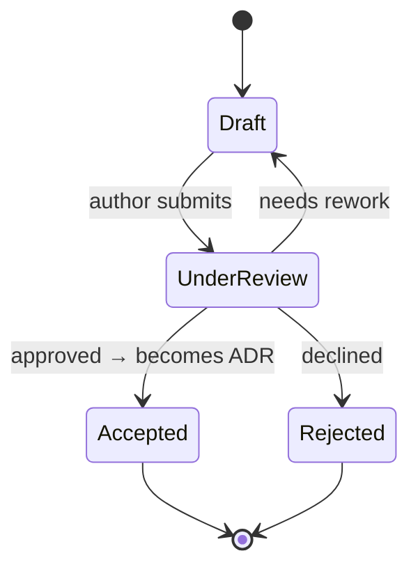

# Request for Comments (RFC)

RFCs capture proposals before they become architectural decisions.

## Lifecycle

- **Draft** — work in progress, not yet ready for review
- **Under Review** — open for feedback and comments
- **Accepted** — converted to an ADR (link to ADR provided)
- **Rejected** — declined; rejection rationale preserved for future reference

## Index

| ID | Title | Status | Date |
|----|-------|--------|------|
| — | — | — | — |

_No RFCs yet._
