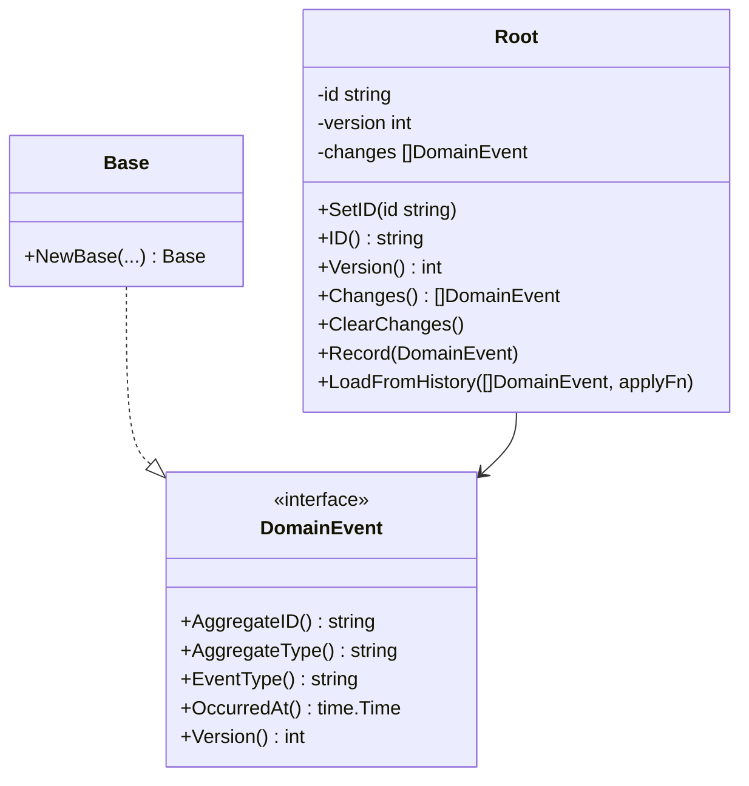

# Domain Layer

## Overview

The domain layer contains the core business logic of the application.
It has **no external dependencies** — only the Go standard library.
All other layers depend on the domain; the domain depends on nothing.

## Bounded Contexts

At this stage the project has a single **shared kernel** with reusable domain primitives.
Bounded contexts will be added as concrete business domains are implemented.

## Contents

- [Aggregate Root](shared/aggregate.md) — `internal/domain/aggregate/aggregate.go`
- [Domain Events](shared/event.md) — `internal/domain/event/event.go`
