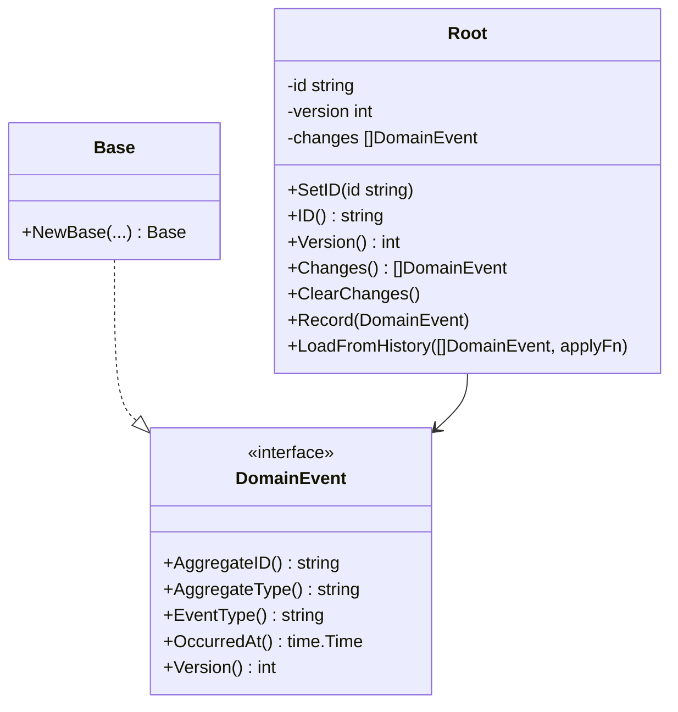

# Domain Layer

## Overview

The domain layer contains the core business logic of the application.
It has **no external dependencies** — only the Go standard library.
All other layers depend on the domain; the domain depends on nothing.

## Bounded Contexts

| Context | Source | Doc |
|---------|--------|-----|
| Wallet | `wallet-service/internal/domain/account/` | [wallet.md](wallet.md) |
| KYC | `kyc-service/internal/domain/kyc/` | [kyc.md](kyc.md) |

## Shared Primitives

## Contents

- [Wallet Domain](wallet.md) — `wallet-service/internal/domain/account/`
- [KYC Domain](kyc.md) — `kyc-service/internal/domain/kyc/`
- [Aggregate Root](shared/aggregate.md) — `internal/domain/aggregate/aggregate.go`
- [Domain Events](shared/event.md) — `internal/domain/event/event.go`
