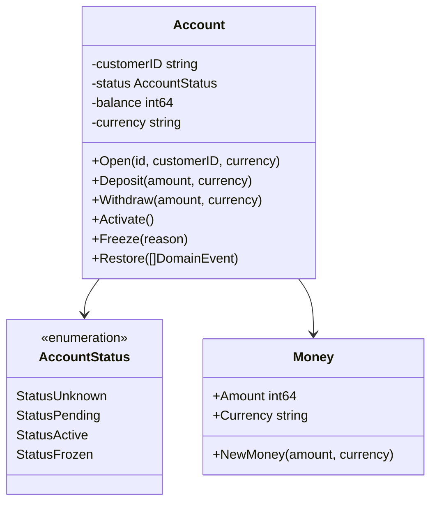
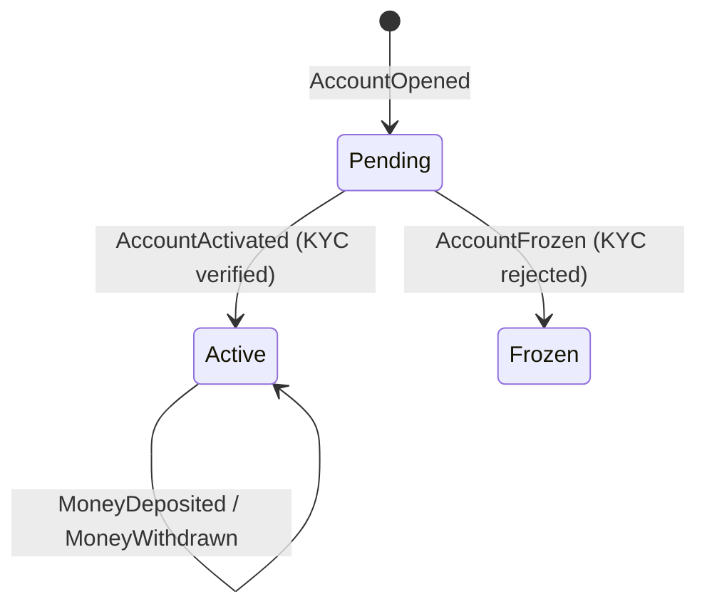
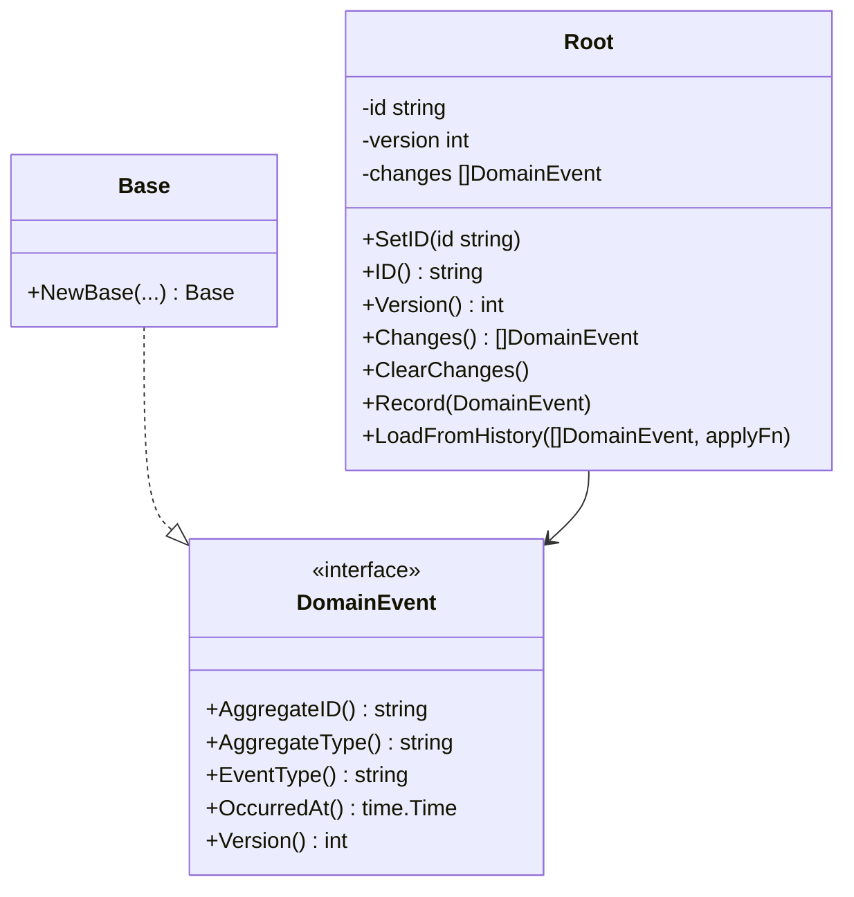

# Domain Layer

## Overview

The domain layer contains the core business logic of the application.
It has **no external dependencies** — only the Go standard library.
All other layers depend on the domain; the domain depends on nothing.

## Bounded Contexts

### Wallet

**Source:** `wallet-service/internal/domain/account/`

The `account` package is the aggregate root for the wallet bounded context.
An `Account` is always rebuilt from its event history — no mutable state is stored in a database.

#### Aggregate: Account

#### Domain Events

| Event | Trigger | Fields |
|-------|---------|--------|
| `AccountOpened` | `Open()` | CustomerID, Currency |
| `MoneyDeposited` | `Deposit()` | Amount, Currency |
| `MoneyWithdrawn` | `Withdraw()` | Amount, Currency |
| `AccountActivated` | `Activate()` | — |
| `AccountFrozen` | `Freeze()` | Reason |

#### Status Transitions

#### Business Rules

- New accounts start in `Pending` status (awaiting KYC verification).
- Deposits are allowed in any non-frozen status.
- Withdrawals require `Active` status.
- Balance is stored in minor units (cents). Amount must be positive.
- Currency must match the account's registered currency.

#### Domain Errors

| Error | Condition |
|-------|-----------|
| `ErrAccountAlreadyExists` | `Open()` called on existing aggregate |
| `ErrAccountNotFound` | No events found for the aggregate ID |
| `ErrNotActive` | Operation requires active (non-frozen) account |
| `ErrNotPending` | `Activate` / `Freeze` require pending status |
| `ErrInsufficientFunds` | Balance < withdrawal amount |
| `ErrCurrencyMismatch` | Deposit/withdraw currency ≠ account currency |
| `ErrNonPositiveAmount` | Amount ≤ 0 |

### Shared Primitives

## Contents

- [Aggregate Root](shared/aggregate.md) — `internal/domain/aggregate/aggregate.go`
- [Domain Events](shared/event.md) — `internal/domain/event/event.go`
