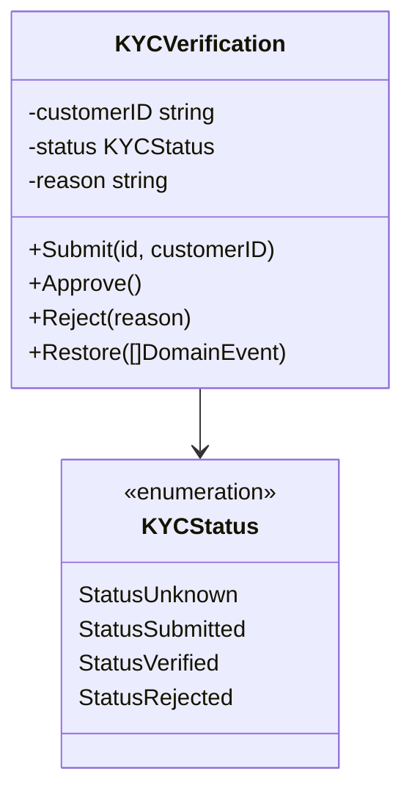
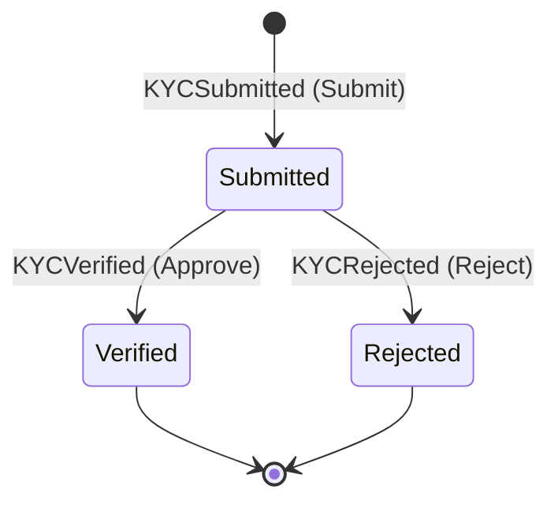

# KYC Domain

**Source:** `kyc-service/internal/domain/kyc/`

## Overview

The `kyc` package is the aggregate root for the KYC bounded context.
A `KYCVerification` is always rebuilt from its event history — no mutable state is stored in a database.
Once verified or rejected, the status is **terminal** — no further transitions.

## Aggregate: KYCVerification

## Status Transitions

## Domain Events

| Event | Trigger | Fields |
|-------|---------|--------|
| `KYCSubmitted` | `Submit()` | CustomerID |
| `KYCVerified` | `Approve()` | — |
| `KYCRejected` | `Reject()` | Reason |

## Business Rules

- Only a `Submitted` verification can be approved or rejected.
- `Verified` and `Rejected` are terminal states — no further transitions.
- `Approve()` on an already-verified verification returns `ErrAlreadyVerified`.
- `Reject()` on an already-rejected verification returns `ErrAlreadyRejected`.

## Domain Errors

| Error | Condition |
|-------|-----------|
| `ErrVerificationAlreadyExists` | `Submit()` called on existing aggregate |
| `ErrVerificationNotFound` | No events found for the aggregate ID |
| `ErrNotSubmitted` | `Approve` / `Reject` require `Submitted` status |
| `ErrAlreadyVerified` | `Approve` called on already-verified verification |
| `ErrAlreadyRejected` | `Reject` called on already-rejected verification |

## Cross-Service Events (Kafka)

When KYC is approved or rejected, the kyc-service publishes contracts events to Kafka
so that wallet-service can activate or freeze the customer's account.

| Domain Event | Kafka Topic | Contracts Event |
|---|---|---|
| `KYCVerified` | `kyc.verified.v1` | `contracts/events.KYCVerified` |
| `KYCRejected` | `kyc.rejected.v1` | `contracts/events.KYCRejected` |

Full Kafka wiring: see [PLAN-006](../plans/plan-006-event-driven-integration.md).
