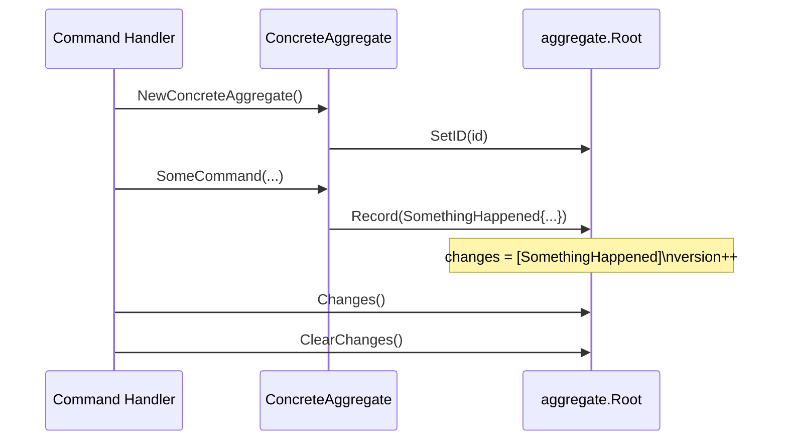

# Aggregate Root

**Source:** `internal/domain/aggregate/aggregate.go`

## Purpose

`aggregate.Root` is the base struct for all aggregate roots in the system.
It implements the event sourcing mechanics: recording uncommitted events and replaying history to restore state.

Every domain aggregate embeds `aggregate.Root` and gains event sourcing for free.

## API

### Fields (private)

| Field | Type | Description |
|-------|------|-------------|
| `id` | `string` | Aggregate identity |
| `version` | `int` | Current version (increments on each recorded event) |
| `changes` | `[]event.DomainEvent` | Uncommitted events not yet persisted |

### Methods

| Method | Returns | Description |
|--------|---------|-------------|
| `SetID(id string)` | — | Sets the aggregate identity (called in concrete aggregate constructors) |
| `ID()` | `string` | Returns the aggregate ID |
| `Version()` | `int` | Returns current version |
| `Changes()` | `[]event.DomainEvent` | Returns uncommitted events |
| `ClearChanges()` | — | Discards uncommitted events after they have been persisted to the event store |
| `Record(e DomainEvent)` | — | Appends an event to uncommitted changes and increments version |
| `LoadFromHistory(events, applyFn)` | — | Replays persisted events; restores version; calls `applyFn` per event |

## Usage Pattern



A concrete aggregate embeds `Root` and calls `Record` when a command produces a domain event:

```go
type OrderAggregate struct {
    aggregate.Root
    status OrderStatus
}

func (o *OrderAggregate) PlaceOrder(id string) {
    o.SetID(id)
    o.Record(event.NewBase(id, "Order", "OrderPlaced", o.Version()+1))
}
```

Restoring state from history uses `LoadFromHistory`:

```go
func (o *OrderAggregate) apply(e event.DomainEvent) {
    switch e.EventType() {
    case "OrderPlaced":
        o.status = StatusPlaced
    }
}

// In the repository:
order.LoadFromHistory(storedEvents, order.apply)
```

## Invariants

- `Version` equals the number of events ever recorded for this aggregate (including history).
- `Changes` contains only events recorded *after* the last `ClearChanges` call — i.e., not yet persisted.
- `LoadFromHistory` does *not* add to `Changes` — replayed events are not re-persisted.

## See Also

- [Domain Events](event.md) — `DomainEvent` interface embedded in each recorded event
- [Domain Layer Overview](../README.md)
- [Event Store](../../infrastructure/eventstore.md) — persists and loads events for aggregates
- Implemented in [PLAN-001](../../plans/plan-001-initial-setup.md)
