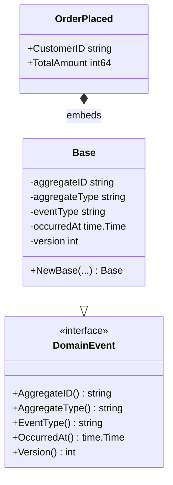

# Domain Events

**Source:** `internal/domain/event/event.go`

## Purpose

Defines the `DomainEvent` interface and a reusable `Base` struct that provides standard event metadata.
All domain events in the system implement `DomainEvent`.

## DomainEvent Interface

| Method | Returns | Description |
|--------|---------|-------------|
| `AggregateID()` | `string` | ID of the aggregate that produced this event |
| `AggregateType()` | `string` | Type name of the aggregate (e.g. `"Order"`) |
| `EventType()` | `string` | Name of the event (e.g. `"OrderPlaced"`) |
| `OccurredAt()` | `time.Time` | UTC timestamp when the event occurred |
| `Version()` | `int` | Aggregate version after this event was applied |

## Base Struct

`Base` is an embeddable struct that implements all `DomainEvent` methods.
Concrete events embed `Base` and add their own payload fields.

### Constructor

```go
func NewBase(aggregateID, aggregateType, eventType string, version int) Base
```

Sets `OccurredAt` to `time.Now().UTC()` at construction time.

## Diagram



## Usage Pattern

```go
type OrderPlaced struct {
    event.Base
    CustomerID  string
    TotalAmount int64
}

// In aggregate:
e := OrderPlaced{
    Base:        event.NewBase(o.ID(), "Order", "OrderPlaced", o.Version()+1),
    CustomerID:  cmd.CustomerID,
    TotalAmount: cmd.Amount,
}
o.Record(e)
```

## See Also

- [Aggregate Root](aggregate.md) — calls `Record(DomainEvent)` to register events
- [Event Store](../../infrastructure/eventstore.md) — persists `[]DomainEvent`
- Implemented in [PLAN-001](../../plans/plan-001-initial-setup.md)
