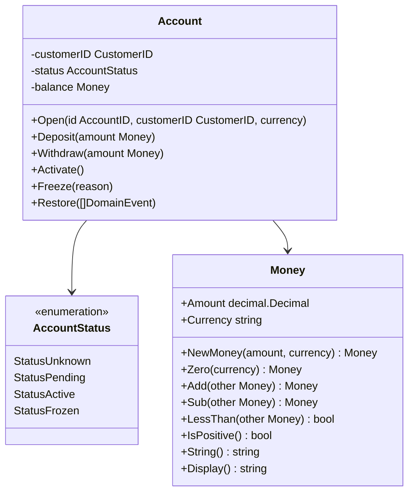
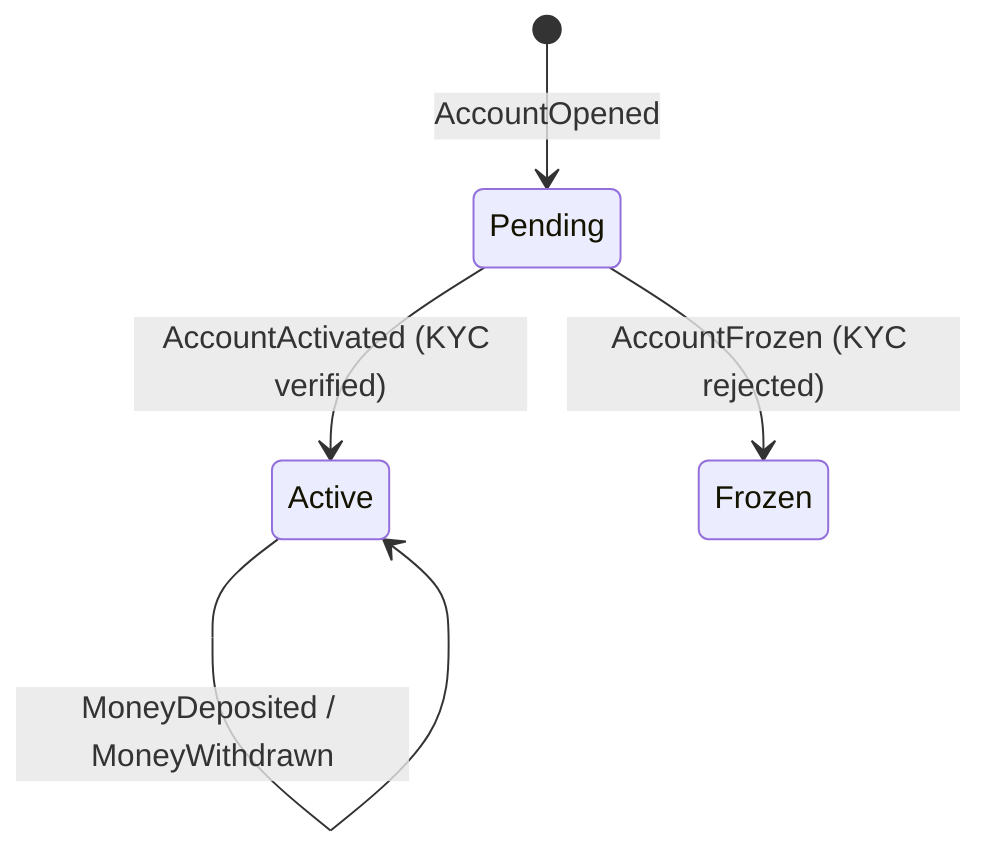

# Wallet Domain

**Source:** `wallet-service/internal/domain/account/`

## Overview

The `account` package is the aggregate root for the wallet bounded context.
An `Account` is always rebuilt from its event history — no mutable state is stored in a database.

## Aggregate: Account

## Status Transitions

## Domain Events

| Event | Trigger | Fields |
|-------|---------|--------|
| `AccountOpened` | `Open()` | CustomerID `CustomerID`, Currency `string` |
| `MoneyDeposited` | `Deposit()` | Amount `Money` |
| `MoneyWithdrawn` | `Withdraw()` | Amount `Money` |
| `AccountActivated` | `Activate()` | — |
| `AccountFrozen` | `Freeze()` | Reason `string` |

## Currency Model

**One Account = one currency.** An account is opened with a fixed ISO 4217 currency code
and enforces it for the lifetime of the aggregate. Deposits and withdrawals in any other
currency are rejected with `ErrCurrencyMismatch`.

Multi-currency wallets are modelled as **multiple Accounts** (one per currency), not as a
single Account with a `map[string]Money` balance. This keeps the aggregate simple and each
event stream semantically cohesive.

## Money Value Object

`Money` wraps `decimal.Decimal` (from `github.com/shopspring/decimal`) together with an
ISO 4217 currency code. Amount and currency are inseparable.

`Display()` applies per-currency formatting conventions:

| Currency | Example | Symbol placement | Decimal separator |
|----------|---------|-----------------|-------------------|
| USD | `$100.00` | before | `.` |
| EUR | `100,00 €` | after | `,` |
| GBP | `£100.00` | before | `.` |
| JPY | `¥1000` | before | `.` (0 decimals) |
| RUB | `100,00 ₽` | after | `,` |
| CHF | `CHF 100.00` | before (code) | `.` |

Unknown currencies fall back to `"100.00 CODE"`.

## Business Rules

- New accounts start in `Pending` status (awaiting KYC verification).
- Deposits are allowed in any non-frozen status.
- Withdrawals require `Active` status and sufficient balance.
- `Money` carries its own currency; `Add`/`Sub` reject mismatched currencies at runtime.
- Amount must be positive (`> 0`).
- IDs (`AccountID`, `CustomerID`) are UUID v7 generated via `github.com/google/uuid`.

## Domain Errors

| Error | Condition |
|-------|-----------|
| `ErrAccountAlreadyExists` | `Open()` called on existing aggregate |
| `ErrAccountNotFound` | No events found for the aggregate ID |
| `ErrNotActive` | Operation requires active (non-frozen) account |
| `ErrNotPending` | `Activate` / `Freeze` require pending status |
| `ErrInsufficientFunds` | Balance < withdrawal amount |
| `ErrCurrencyMismatch` | Deposit/withdraw currency ≠ account currency |
| `ErrNonPositiveAmount` | Amount ≤ 0 |
