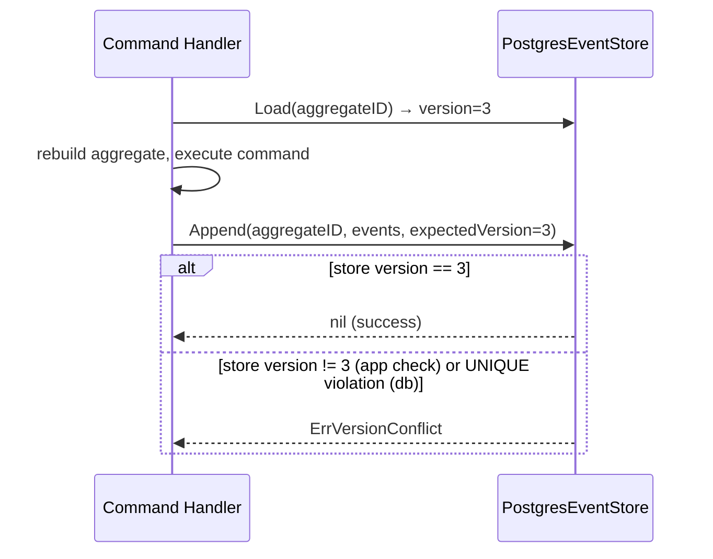

# Event Store

**Source:** `wallet-service/internal/infrastructure/eventstore/`

## Interface

**File:** `store.go`

```go
type EventStore interface {
    Append(ctx context.Context, aggregateID string, events []event.DomainEvent, expectedVersion int) error
    Load(ctx context.Context, aggregateID string) ([]event.DomainEvent, error)
}
```

### Append

Appends a slice of domain events to the event stream for `aggregateID`.

`expectedVersion` is the aggregate version *before* these events — used for **optimistic concurrency control**.
If the current version in the store differs from `expectedVersion`, the implementation returns `ErrVersionConflict`.

### Load

Returns all events for `aggregateID`, ordered by version ascending.
Used by command handlers to restore aggregate state via `LoadFromHistory`.

### Errors

| Error | When |
|-------|------|
| `ErrVersionConflict` | `Append` called with stale `expectedVersion` |

## PostgreSQL Implementation

**File:** `postgres.go`

`PostgresEventStore` persists events to the `events` table. Two-level optimistic concurrency:
1. Application-level: reads current max version before insert, returns `ErrVersionConflict` if mismatch
2. Database-level: `UNIQUE(aggregate_id, event_version)` constraint — maps `23505` pg error to `ErrVersionConflict`

### Schema

```sql
CREATE TABLE events (
    global_seq    BIGSERIAL NOT NULL,          -- global cursor for projector
    id            UUID NOT NULL,
    aggregate_id  UUID NOT NULL,
    aggregate_type TEXT NOT NULL,
    event_type    TEXT NOT NULL,
    event_version INT NOT NULL,
    payload       JSONB NOT NULL,
    occurred_at   TIMESTAMPTZ NOT NULL,
    UNIQUE (aggregate_id, event_version)
);
```

`global_seq BIGSERIAL` is the append-only cursor used by the async projector to poll new events.
`aggregate_id` is `UUID` (not `TEXT`) — all queries use `$1::uuid` explicit cast.

### Event ID generation

Each event row gets a fresh UUID v7 at insert time: `uuid.Must(uuid.NewV7()).String()`.

## Event Registry

**Files:** `registry.go`, `account_registry.go`

The registry decouples event serialization from the store. Each event type is registered with a `SerializeFunc` / `DeserializeFunc` pair.

```go
type Registry struct { ... }

func (r *Registry) Register(eventType string, serialize SerializeFunc, deserialize DeserializeFunc)
func (r *Registry) Serialize(e event.DomainEvent) ([]byte, error)
func (r *Registry) Deserialize(eventType string, payload []byte, base event.Base) (event.DomainEvent, error)
```

`NewAccountRegistry()` registers all 5 wallet account events.

### Money serialization

`Money` fields are serialized to JSONB as `{"amount": "100.50", "currency": "USD"}` — amount as **string**, never float. Deserialized via `decimal.NewFromString()`.

### Event restoration

`event.RestoreBase()` reconstructs `event.Base` from persisted fields without calling `time.Now()` — the original `occurredAt` is preserved.

## Optimistic Concurrency Flow



## See Also

- [Async Projector](projector.md) — consumes `global_seq` to build read models
- [Aggregate Root](../domain/shared/aggregate.md) — calls `ClearChanges` after successful append
- [Domain Events](../domain/shared/event.md) — `[]event.DomainEvent` payload
- [PLAN-007](../plans/plan-007-postgresql-event-store.md) — implementation plan
