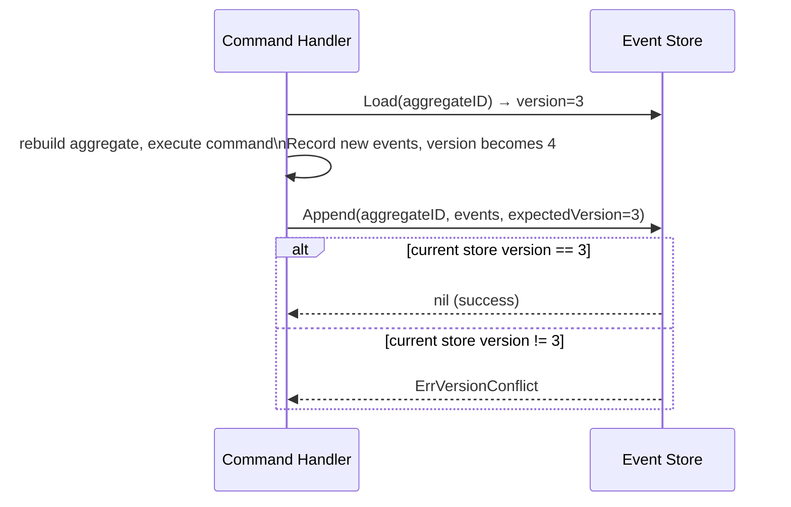

# Event Store

**Source:** `internal/infrastructure/eventstore/store.go`

## Purpose

Defines the `EventStore` interface — the contract for persisting and loading domain events.
Implementations are provided separately (in-memory, PostgreSQL, etc.).

## Interface

```go
type EventStore interface {
    Append(ctx context.Context, aggregateID string, events []event.DomainEvent, expectedVersion int) error
    Load(ctx context.Context, aggregateID string) ([]event.DomainEvent, error)
}
```

### Append

Appends a slice of domain events to the event stream for `aggregateID`.

`expectedVersion` is the aggregate version *before* these events — used for **optimistic concurrency control**.
If the current version in the store differs from `expectedVersion`, the implementation must return `ErrVersionConflict`.

### Load

Returns all events for `aggregateID`, ordered by version ascending.
Used by command handlers to restore aggregate state via `LoadFromHistory`.

## Errors

| Error | When |
|-------|------|
| `ErrVersionConflict` | `Append` called with `expectedVersion` that doesn't match current store version |

`ErrVersionConflict` is a sentinel error — use `errors.Is` to check:

```go
err := store.Append(ctx, id, events, expectedVersion)
if errors.Is(err, eventstore.ErrVersionConflict) {
    // retry or return conflict response
}
```

## Optimistic Concurrency Flow



## See Also

- [Aggregate Root](../domain/shared/aggregate.md) — calls `ClearChanges` after successful append
- [Domain Events](../domain/shared/event.md) — `[]event.DomainEvent` is the payload
- Implemented in [PLAN-001](../plans/plan-001-initial-setup.md)
