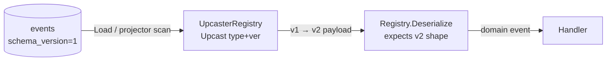
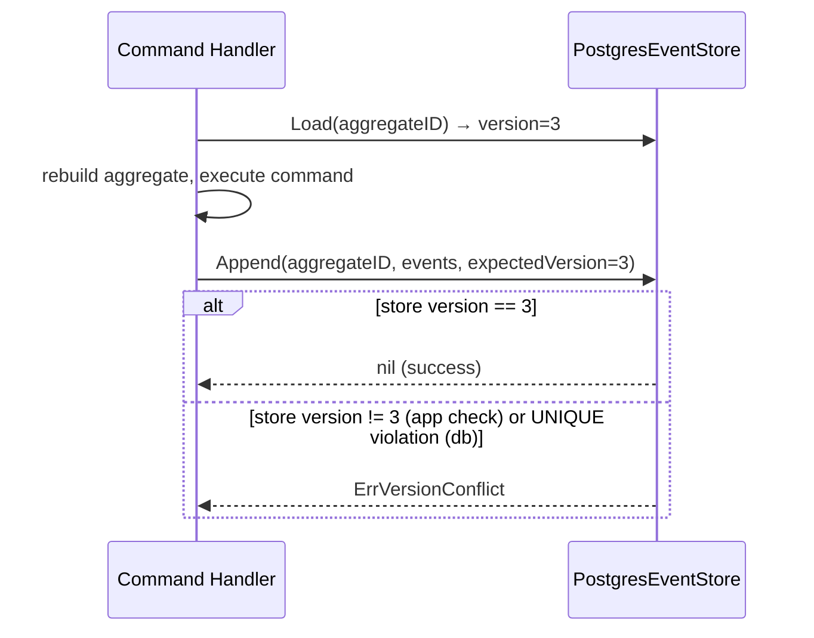

# Event Store

**Source:** `wallet-service/internal/infrastructure/eventstore/`

## Interface

**File:** `store.go`

```go
type EventStore interface {
    Append(ctx context.Context, aggregateID string, events []event.DomainEvent, expectedVersion int) error
    Load(ctx context.Context, aggregateID string) ([]event.DomainEvent, error)
}
```

### Append

Appends a slice of domain events to the event stream for `aggregateID`.

`expectedVersion` is the aggregate version *before* these events — used for **optimistic concurrency control**.
If the current version in the store differs from `expectedVersion`, the implementation returns `ErrVersionConflict`.

### Load

Returns all events for `aggregateID`, ordered by version ascending.
Used by command handlers to restore aggregate state via `LoadFromHistory`.

### Errors

| Error | When |
|-------|------|
| `ErrVersionConflict` | `Append` called with stale `expectedVersion` |

## PostgreSQL Implementation

**File:** `postgres.go`

`PostgresEventStore` persists events to the `events` table. Two-level optimistic concurrency:
1. Application-level: reads current max version before insert, returns `ErrVersionConflict` if mismatch
2. Database-level: `UNIQUE(aggregate_id, event_version)` constraint — maps `23505` pg error to `ErrVersionConflict`

### Schema

```sql
CREATE TABLE events (
    global_seq     BIGSERIAL NOT NULL,          -- global cursor for projector
    id             UUID NOT NULL,
    aggregate_id   UUID NOT NULL,
    aggregate_type TEXT NOT NULL,
    event_type     TEXT NOT NULL,
    event_version  INT NOT NULL,                -- aggregate stream position (optimistic concurrency)
    schema_version INT NOT NULL DEFAULT 1,      -- JSONB payload shape version (upcasting)
    payload        JSONB NOT NULL,
    occurred_at    TIMESTAMPTZ NOT NULL,
    UNIQUE (aggregate_id, event_version)
);
```

`global_seq BIGSERIAL` is the append-only cursor used by the async projector to poll new events.
`aggregate_id` is `UUID` (not `TEXT`) — all queries use `$1::uuid` explicit cast.

**Do not confuse `event_version` and `schema_version`:**

| Field | Meaning |
|---|---|
| `event_version` | Position in the aggregate's event stream. Used for optimistic concurrency. |
| `schema_version` | Version of the JSONB payload shape. Used for upcasting old rows at read time. |

### Event ID generation

Each event row gets a fresh UUID v7 at insert time: `uuid.Must(uuid.NewV7()).String()`.

## Event Registry

**Files:** `registry.go`, `account_registry.go`

The registry decouples event serialization from the store. Each event type is registered with a `SerializeFunc` / `DeserializeFunc` pair and a schema version.

```go
type Registry struct { ... }

// Register an event at schema version 1 (default).
func (r *Registry) Register(eventType string, serialize SerializeFunc, deserialize DeserializeFunc)

// RegisterV registers an event at an explicit schema version (use when introducing v2, v3, …).
func (r *Registry) RegisterV(eventType string, version int, serialize SerializeFunc, deserialize DeserializeFunc)

// GetLatestVersion returns the schema version the codec expects. Returns 1 if not registered.
func (r *Registry) GetLatestVersion(eventType string) int

func (r *Registry) Serialize(e event.DomainEvent) ([]byte, error)
func (r *Registry) Deserialize(eventType string, base event.Base, payload []byte) (event.DomainEvent, error)
```

`NewAccountRegistry()` registers all 5 wallet account events. `MoneyDeposited` is registered at schema v2.

## Schema Versioning and Upcasting

**Files:** `upcaster.go`, `account_upcasters.go`

When an event's JSONB shape changes, old rows are not rewritten. An **upcaster** transforms the old payload into the new shape at read time, transparently, before deserialization.



`Append` reads `registry.GetLatestVersion(eventType)` and stores it as `schema_version`.
`Load` and the projector scan read `schema_version` and call `upcasters.Upcast(...)` before deserialization.

```go
type UpcasterRegistry struct { ... }

// Register an upcaster from fromVersion → fromVersion+1.
func (r *UpcasterRegistry) Register(eventType string, fromVersion int, fn UpcastFunc)

// Upcast chains transforms until no upcaster is found for (eventType, currentVersion).
func (r *UpcasterRegistry) Upcast(eventType string, schemaVersion int, payload []byte) ([]byte, error)
```

`NewAccountUpcasterRegistry()` registers the `MoneyDeposited` v1→v2 upcaster (adds `description` field with default `""`).

### Adding a new schema version

1. Update the event struct (add/rename/remove fields).
2. Call `RegisterV(eventType, N, ...)` in the registry for the new shape.
3. Add an `UpcastFunc` from `N-1` → `N` in `account_upcasters.go`.
4. No migration needed — old rows are transformed at read time.

### Money serialization

`Money` fields are serialized to JSONB as `{"amount": "100.50", "currency": "USD"}` — amount as **string**, never float. Deserialized via `decimal.NewFromString()`.

### Event restoration

`event.RestoreBase()` reconstructs `event.Base` from persisted fields without calling `time.Now()` — the original `occurredAt` is preserved.

## Optimistic Concurrency Flow



## See Also

- [Async Projector](projector.md) — consumes `global_seq` to build read models
- [Aggregate Root](../domain/shared/aggregate.md) — calls `ClearChanges` after successful append
- [Domain Events](../domain/shared/event.md) — `[]event.DomainEvent` payload
- [PLAN-007](../plans/plan-007-postgresql-event-store.md) — PostgreSQL event store
- [PLAN-009](../plans/plan-009-event-versioning.md) — event schema versioning (upcasting)
