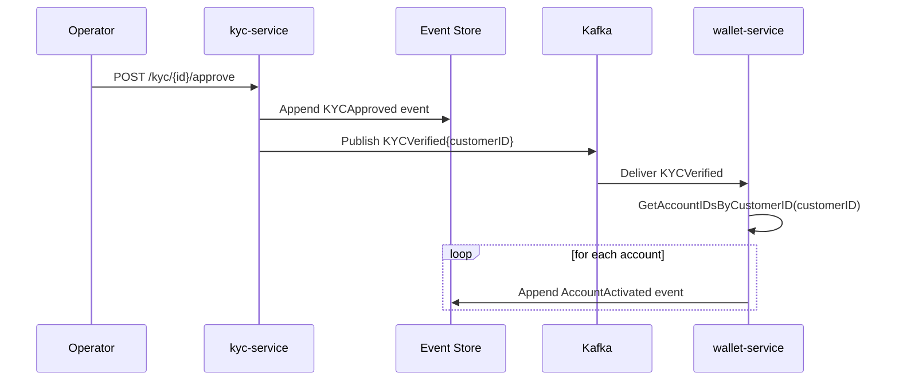

# Kafka Infrastructure

Introduced in [PLAN-006](../plans/plan-006-event-driven-integration.md).

## Local Setup (Docker Compose)

```yaml
image: apache/kafka:3.9.0
```

KRaft mode — no ZooKeeper. Single broker, single node.

### Listeners

Two PLAINTEXT listeners:

| Listener | Address | Purpose |
|----------|---------|---------|
| `PLAINTEXT` | `192.168.1.61:9092` | External clients (services on the host) |
| `INTERNAL` | `localhost:29092` | Within-container use (healthcheck) |
| `CONTROLLER` | `kafka:9093` | KRaft controller (internal, not exposed) |

Healthcheck uses `INTERNAL` (`localhost:29092`) because `192.168.1.61` is not reachable from inside the container bridge network.

### Environment

```yaml
KAFKA_LISTENERS:          PLAINTEXT://0.0.0.0:9092,INTERNAL://0.0.0.0:29092,CONTROLLER://kafka:9093
KAFKA_ADVERTISED_LISTENERS: PLAINTEXT://192.168.1.61:9092,INTERNAL://localhost:29092
KAFKA_LISTENER_SECURITY_PROTOCOL_MAP: PLAINTEXT:PLAINTEXT,INTERNAL:PLAINTEXT,CONTROLLER:PLAINTEXT
KAFKA_INTER_BROKER_LISTENER_NAME: INTERNAL
KAFKA_CONTROLLER_QUORUM_VOTERS: 1@kafka:9093
KAFKA_AUTO_CREATE_TOPICS_ENABLE: "true"
```

## Topics

Defined in `contracts/topics/`. Auto-created on first produce.

| Constant | Topic name | Publisher | Consumer |
|----------|------------|-----------|---------|
| `topics.KYCVerified` | `kyc.verified.v1` | kyc-service | wallet-service |
| `topics.KYCRejected` | `kyc.rejected.v1` | kyc-service | wallet-service |

## Event Flow



Same flow for rejection (KYCRejected → FreezeAccount).

## Publisher (`kyc-service`)

`kyc-service/internal/infrastructure/messaging/publisher.go`

```go
type KafkaPublisher struct{ writer *kafka.Writer }
```

- Uses `segmentio/kafka-go` v0.4.47
- `LeastBytes` balancer
- `WriteTimeout: 10s`, `ReadTimeout: 10s` — prevents indefinite block on Kafka unavailability
- `Close()` flushes and closes the writer on app shutdown (registered via `registerPublisherShutdown`)

Compile-time interface check:
```go
var _ appkyc.EventPublisher = (*KafkaPublisher)(nil)
```

### Dual-write hazard

The handler appends to the event store **then** publishes. If Kafka is down after the append, domain state is committed but the integration event is lost. For production, use the **outbox pattern**: write the event to a DB table in the same transaction, relay asynchronously.

## Consumer (`wallet-service`)

`wallet-service/internal/infrastructure/kafka/consumer.go`

```go
type KYCEventConsumer struct {
    reader *kafka.Reader
    repo   appaccount.AccountReadRepository
    bus    command.Bus
    log    *slog.Logger
}
```

- Consumer group: `wallet-service`
- Subscribes to: `KYCVerified`, `KYCRejected`
- Pattern: `FetchMessage` → handle → `CommitMessages` (manual commit, at-least-once)
- Handles multiple accounts per customer (`GetAccountIDsByCustomerID`)

### Idempotency

`ErrNotPending` from the domain means the account is already Active or Frozen — treated as a duplicate, logged and skipped. Commit still proceeds so the offset advances.

### Graceful shutdown

`startKYCConsumer` in `wallet-service/internal/app/providers.go`:

```go
ctx, cancel := context.WithCancel(context.Background())
// OnStop: cancel() then consumer.Close()
```

Cancelling the context causes `FetchMessage(ctx)` to return `context.Canceled`, which the `Run` loop treats as a clean stop signal.
