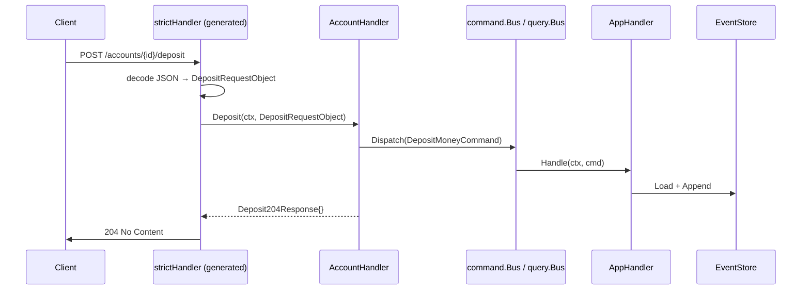

# Wallet Service — HTTP Interface

**Source:** `wallet-service/internal/interfaces/http/`

## Overview

HTTP interface is **OpenAPI-first**: the spec lives in `wallet-service/api/openapi.yaml` and the server interface is generated via `oapi-codegen`. Handlers implement the generated `StrictServerInterface` — no manual DTO structs, no manual route wiring.

## Code Generation

**Tool:** `github.com/oapi-codegen/oapi-codegen/v2` (strict-server + chi-server mode)

**Config:** `wallet-service/api/oapi-codegen.yaml`

```yaml
package: gen
output: ../internal/interfaces/http/gen/server.gen.go
generate:
  strict-server: true
  chi-server: true
  models: true
  embedded-spec: false
```

**Regenerate:**

```bash
cd wallet-service
go generate ./api/...
```

**Generated file:** `internal/interfaces/http/gen/server.gen.go` — do not edit manually.

### What gets generated

| Symbol | Description |
|--------|-------------|
| `StrictServerInterface` | Interface with typed `(ctx, RequestObject) → (ResponseObject, error)` methods |
| `ServerInterface` | Raw `http.Handler`-compatible interface |
| `HandlerFromMux(si, r)` | Registers all routes onto a chi router |
| `NewStrictHandler(ssi, middlewares)` | Wraps `StrictServerInterface` → `ServerInterface` |
| `NewStrictHandlerWithOptions(...)` | Same + custom error handlers |
| Request/Response types | e.g. `DepositRequestObject`, `Deposit204Response`, `Deposit422JSONResponse` |
| Model types | e.g. `BalanceResponse`, `TransactionRecord`, `MoneyRequest` |

### Type mapping

| OpenAPI type | Go type |
|---|---|
| `string / format: uuid` | `openapi_types.UUID` (= `uuid.UUID` from google/uuid) |
| `number / x-go-type: decimal.Decimal` | `decimal.Decimal` from shopspring |
| `string / format: date-time` | `time.Time` |
| Enum strings | Typed `string` aliases with `.Valid()` method |

## Router

**Source:** `internal/interfaces/http/router.go`

```go
func NewRouter(health *handler.HealthHandler, account *handler.AccountHandler, log *slog.Logger) *chi.Mux
```

Wires the handler via:
```go
strict := gen.NewStrictHandlerWithOptions(account, nil, gen.StrictHTTPServerOptions{...})
gen.HandlerFromMux(strict, r)
```

### Middleware Stack

| Middleware | Purpose |
|------------|---------|
| `chi/middleware.RequestID` | Attaches unique request ID to context |
| `chi/middleware.RealIP` | Reads real client IP from `X-Forwarded-For` / `X-Real-IP` |
| `chi/middleware.Recoverer` | Recovers panics, returns HTTP 500 |

## Handler

**Source:** `internal/interfaces/http/handler/account.go`

`AccountHandler` implements `gen.StrictServerInterface`. Each method:
1. Converts `openapi_types.UUID` → typed domain ID (`domain.AccountID`, `domain.CustomerID`)
2. Dispatches command / asks query
3. Returns a typed response object (e.g. `Deposit204Response`, `Deposit422JSONResponse`) — never writes to `http.ResponseWriter` directly

Compile-time check: `var _ gen.StrictServerInterface = (*AccountHandler)(nil)`

## Endpoints

### Health

| Method | Path | Description |
|--------|------|-------------|
| `GET` | `/health` | Returns service health status |

**Response** `200 OK`
```json
{ "status": "ok" }
```

### Accounts

| Method | Path | Description |
|--------|------|-------------|
| `POST` | `/accounts` | Open a new account |
| `POST` | `/accounts/{id}/activate` | Activate account (KYC approved) |
| `POST` | `/accounts/{id}/freeze` | Freeze account (KYC rejected or manual) |
| `POST` | `/accounts/{id}/deposit` | Deposit funds |
| `POST` | `/accounts/{id}/withdraw` | Withdraw funds |
| `GET` | `/accounts/{id}/balance` | Get current balance and status |
| `GET` | `/accounts/{id}/transactions` | Get deposit/withdrawal history |

#### POST /accounts

Request:
```json
{ "customer_id": "018f1e2a-...", "currency": "USD" }
```

Response `201 Created`:
```json
{ "account_id": "018f1e2b-..." }
```

Error `422` — unsupported currency or account already exists.

#### POST /accounts/{id}/activate

No request body. Response `204 No Content`.

Error `404` — account not found. Error `422` — account not in Pending status.

#### POST /accounts/{id}/freeze

Request:
```json
{ "reason": "KYC rejected" }
```

Response `204 No Content`.

Error `404` — account not found. Error `422` — account not Active.

#### POST /accounts/{id}/deposit

Request:
```json
{ "amount": "100.50", "currency": "USD" }
```

Response `204 No Content`.

Error `404` — account not found. Error `422` — non-positive amount, currency mismatch, account not Active.

#### POST /accounts/{id}/withdraw

Same shape as deposit.

Error `422` also covers insufficient funds.

#### GET /accounts/{id}/balance

Response `200 OK`:
```json
{
  "account_id": "018f1e2b-...",
  "customer_id": "018f1e2a-...",
  "balance": "95.50",
  "currency": "USD",
  "status": "Active"
}
```

`status` enum: `Pending` | `Active` | `Frozen`

#### GET /accounts/{id}/transactions

Response `200 OK`:
```json
[
  { "type": "deposit",    "amount": "100.50", "currency": "USD", "occurred_at": "2024-01-01T10:00:00Z" },
  { "type": "withdrawal", "amount": "5.00",   "currency": "USD", "occurred_at": "2024-01-01T11:00:00Z" }
]
```

`type` enum: `deposit` | `withdrawal`

### Error Responses

All errors follow the `Error` schema:

```json
{ "message": "account: insufficient funds" }
```

| Status | Condition |
|--------|-----------|
| `400 Bad Request` | Malformed JSON body (from `RequestErrorHandlerFunc`) |
| `404 Not Found` | Resource does not exist |
| `422 Unprocessable Entity` | Business rule violation |
| `500 Internal Server Error` | Unexpected server error |

## HTTP → Application Flow



## See Also

- [KYC HTTP Interface](kyc-http.md)
- [Interfaces Overview](README.md)
- [Command Bus](../application/commands.md)
- [Query Bus](../application/queries.md)
- [PLAN-010](../plans/plan-010-openapi-codegen.md) — OpenAPI-first HTTP layer
