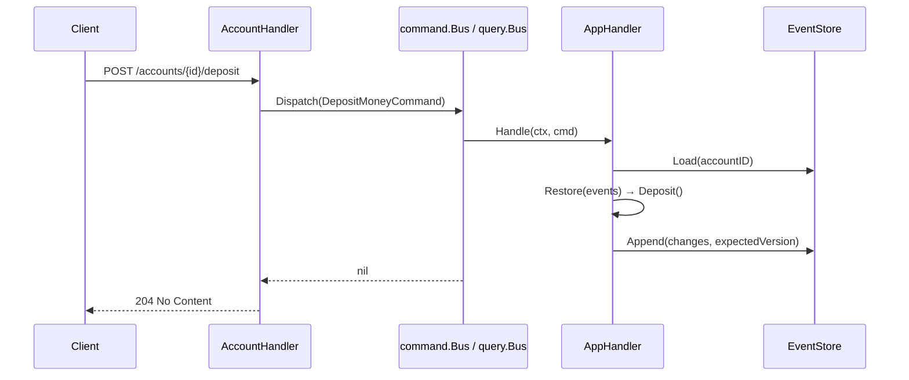
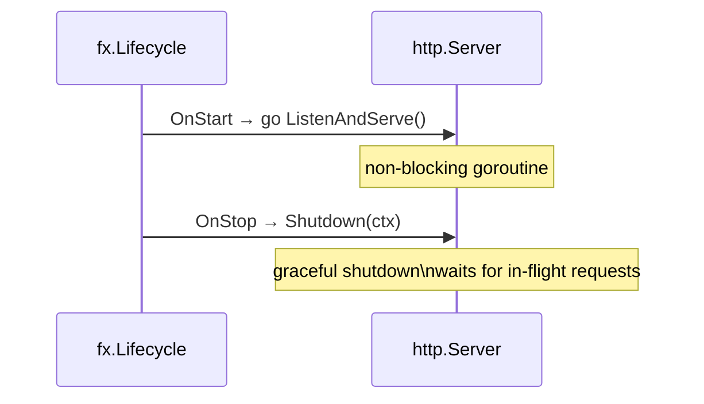

# HTTP Interface

**Source:** `internal/interfaces/http/`

## Overview

HTTP interface built on `chi` v5. The router is constructed via `NewRouter` and wired into `uber/fx` as an `*http.Server`.

## Router

**Source:** `internal/interfaces/http/router.go`

```go
func NewRouter(health *handler.HealthHandler, account *handler.AccountHandler) *chi.Mux
```

Returns a configured `*chi.Mux` ready to be passed to `http.Server`.

### Middleware Stack

Applied globally in order:

| Middleware | Purpose |
|------------|---------|
| `chi/middleware.RequestID` | Attaches a unique request ID to every request context |
| `chi/middleware.RealIP` | Reads the real client IP from `X-Forwarded-For` / `X-Real-IP` |
| `chi/middleware.Recoverer` | Recovers from panics, returns HTTP 500 |

## Endpoints

### Health

| Method | Path | Handler | Description |
|--------|------|---------|-------------|
| `GET` | `/health` | `HealthHandler.Handle` | Returns service health status |

**Response** `200 OK`

```json
{ "status": "ok" }
```

### Accounts

| Method | Path | Handler | Description |
|--------|------|---------|-------------|
| `POST` | `/accounts` | `AccountHandler.OpenAccount` | Open a new account |
| `POST` | `/accounts/{id}/deposit` | `AccountHandler.Deposit` | Deposit funds |
| `POST` | `/accounts/{id}/withdraw` | `AccountHandler.Withdraw` | Withdraw funds |
| `GET` | `/accounts/{id}/balance` | `AccountHandler.GetBalance` | Get current balance |
| `GET` | `/accounts/{id}/transactions` | `AccountHandler.GetTransactions` | Get transaction history |

#### POST /accounts

Request:
```json
{ "customer_id": "cust-123", "currency": "USD" }
```

Response `201 Created`:
```json
{ "account_id": "a1b2c3d4-..." }
```

#### POST /accounts/{id}/deposit

Request:
```json
{ "amount": 10000, "currency": "USD" }
```

Response `204 No Content`

#### POST /accounts/{id}/withdraw

Request:
```json
{ "amount": 5000, "currency": "USD" }
```

Response `204 No Content`

#### GET /accounts/{id}/balance

Response `200 OK`:
```json
{
  "account_id": "a1b2c3d4-...",
  "customer_id": "cust-123",
  "balance": 5000,
  "currency": "USD",
  "status": "Active"
}
```

#### GET /accounts/{id}/transactions

Response `200 OK`:
```json
[
  { "type": "deposit",    "amount": 10000, "currency": "USD", "occurred_at": "2024-01-01T10:00:00Z" },
  { "type": "withdrawal", "amount": 5000,  "currency": "USD", "occurred_at": "2024-01-01T11:00:00Z" }
]
```

### Error Responses

| Status | Condition |
|--------|-----------|
| `400 Bad Request` | Malformed JSON body |
| `404 Not Found` | Account does not exist |
| `422 Unprocessable Entity` | Business rule violation (insufficient funds, wrong currency, wrong status, etc.) |
| `500 Internal Server Error` | Unexpected server error |

```json
{ "message": "account: insufficient funds" }
```

## HTTP → Application Flow



## Server Lifecycle (uber/fx)



## See Also

- [Interfaces Overview](README.md)
- [Command Bus](../application/commands.md) — dispatched from HTTP handlers
- [Query Bus](../application/queries.md) — queried from HTTP handlers
- Implemented in [PLAN-001](../plans/plan-001-initial-setup.md) and [PLAN-004](../plans/plan-004-wallet-service.md)
