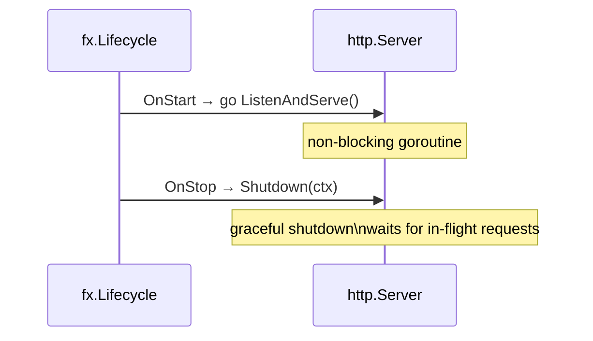

# HTTP Interface

**Source:** `internal/interfaces/http/`

## Overview

HTTP interface built on `chi` v5. The router is constructed via `NewRouter` and wired into `uber/fx` as an `*http.Server`.

## Router

**Source:** `internal/interfaces/http/router.go`

```go
func NewRouter(health *handler.HealthHandler) *chi.Mux
```

Returns a configured `*chi.Mux` ready to be passed to `http.Server`.

### Middleware Stack

Applied globally in order:

| Middleware | Purpose |
|------------|---------|
| `chi/middleware.RequestID` | Attaches a unique request ID to every request context |
| `chi/middleware.RealIP` | Reads the real client IP from `X-Forwarded-For` / `X-Real-IP` |
| `chi/middleware.Recoverer` | Recovers from panics, returns HTTP 500 |

## Endpoints

| Method | Path | Handler | Description |
|--------|------|---------|-------------|
| `GET` | `/health` | `HealthHandler.Handle` | Returns service health status |

### GET /health

**Source:** `internal/interfaces/http/handler/health.go`

Response: `200 OK`

```json
{ "status": "ok" }
```

Content-Type: `application/json`

## Server Lifecycle (uber/fx)



## See Also

- [Interfaces Overview](README.md)
- [Command Bus](../application/commands.md) — dispatched from HTTP handlers
- [Query Bus](../application/queries.md) — queried from HTTP handlers
- Implemented in [PLAN-001](../plans/plan-001-initial-setup.md)
