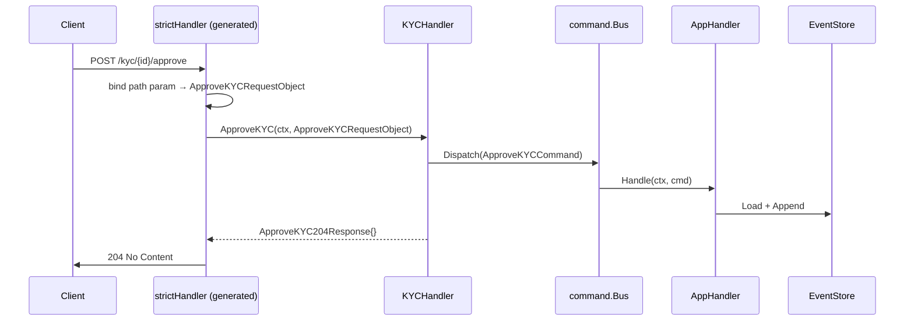

# KYC Service — HTTP Interface

**Source:** `kyc-service/internal/interfaces/http/`

## Overview

HTTP interface is **OpenAPI-first**: the spec lives in `kyc-service/api/openapi.yaml` and the server interface is generated via `oapi-codegen`. Handlers implement the generated `StrictServerInterface` — no manual DTO structs, no manual route wiring.

## Code Generation

**Tool:** `github.com/oapi-codegen/oapi-codegen/v2` (strict-server + chi-server mode)

**Config:** `kyc-service/api/oapi-codegen.yaml`

```yaml
package: gen
output: ../internal/interfaces/http/gen/server.gen.go
generate:
  strict-server: true
  chi-server: true
  models: true
  embedded-spec: false
```

**Regenerate:**

```bash
cd kyc-service
go generate ./api/...
```

**Generated file:** `internal/interfaces/http/gen/server.gen.go` — do not edit manually.

### What gets generated

| Symbol | Description |
|--------|-------------|
| `StrictServerInterface` | Interface with typed `(ctx, RequestObject) → (ResponseObject, error)` methods |
| `HandlerFromMux(si, r)` | Registers all routes onto a chi router |
| `NewStrictHandlerWithOptions(...)` | Wraps `StrictServerInterface` → `ServerInterface` with custom error handlers |
| Request/Response types | e.g. `SubmitKYCRequestObject`, `ApproveKYC204Response`, `ApproveKYC422JSONResponse` |
| Model types | e.g. `KYCStatusResponse`, `SubmitKYCRequest`, `RejectKYCRequest` |

### Type mapping

| OpenAPI type | Go type |
|---|---|
| `string / format: uuid` | `openapi_types.UUID` (= `uuid.UUID` from google/uuid) |
| Enum strings | Typed `string` aliases with `.Valid()` method |

## Router

**Source:** `internal/interfaces/http/router.go`

```go
func NewRouter(health *handler.HealthHandler, kyc *handler.KYCHandler, log *slog.Logger) *chi.Mux
```

Wires the handler via:
```go
strict := gen.NewStrictHandlerWithOptions(kyc, nil, gen.StrictHTTPServerOptions{...})
gen.HandlerFromMux(strict, r)
```

### Middleware Stack

| Middleware | Purpose |
|------------|---------|
| `chi/middleware.RequestID` | Attaches unique request ID to context |
| `chi/middleware.RealIP` | Reads real client IP from `X-Forwarded-For` / `X-Real-IP` |
| `chi/middleware.Recoverer` | Recovers panics, returns HTTP 500 |

## Handler

**Source:** `internal/interfaces/http/handler/kyc.go`

`KYCHandler` implements `gen.StrictServerInterface`. Each method:
1. Converts `openapi_types.UUID` → typed domain ID (`domain.VerificationID`, `domain.CustomerID`)
2. Dispatches command / asks query
3. Returns a typed response object — never writes to `http.ResponseWriter` directly

Compile-time check: `var _ gen.StrictServerInterface = (*KYCHandler)(nil)`

## Endpoints

### Health

| Method | Path | Description |
|--------|------|-------------|
| `GET` | `/health` | Returns service health status |

**Response** `200 OK`
```json
{ "status": "ok" }
```

### KYC Verification

| Method | Path | Description |
|--------|------|-------------|
| `POST` | `/kyc` | Submit a new KYC verification |
| `POST` | `/kyc/{id}/approve` | Approve verification (KYC passed) |
| `POST` | `/kyc/{id}/reject` | Reject verification (KYC failed) |
| `GET` | `/kyc/{id}` | Get current verification status |

#### POST /kyc

Request:
```json
{ "customer_id": "018f1e2a-..." }
```

Response `201 Created`:
```json
{ "verification_id": "018f1e2b-..." }
```

Error `422` — verification already exists for this customer.

#### POST /kyc/{id}/approve

No request body. Response `204 No Content`.

Error `404` — verification not found. Error `422` — not in Submitted status (already verified or rejected).

#### POST /kyc/{id}/reject

Request:
```json
{ "reason": "Document expired" }
```

Response `204 No Content`.

Error `404` — verification not found. Error `422` — not in Submitted status.

#### GET /kyc/{id}

Response `200 OK`:
```json
{
  "verification_id": "018f1e2b-...",
  "customer_id": "018f1e2a-...",
  "status": "Verified"
}
```

On rejection, `reason` field is present:
```json
{
  "verification_id": "018f1e2b-...",
  "customer_id": "018f1e2a-...",
  "status": "Rejected",
  "reason": "Document expired"
}
```

`status` enum: `Submitted` | `Verified` | `Rejected`

### Error Responses

All errors follow the `Error` schema:

```json
{ "message": "kyc: verification is already verified" }
```

| Status | Condition |
|--------|-----------|
| `400 Bad Request` | Malformed JSON body |
| `404 Not Found` | Verification does not exist |
| `422 Unprocessable Entity` | Business rule violation |
| `500 Internal Server Error` | Unexpected server error |

## HTTP → Application Flow



## See Also

- [Wallet HTTP Interface](http.md)
- [KYC Domain](../domain/kyc.md)
- [PLAN-010](../plans/plan-010-openapi-codegen.md) — OpenAPI-first HTTP layer
- [PLAN-006](../plans/plan-006-event-driven-integration.md) — Kafka publishing after approve/reject
