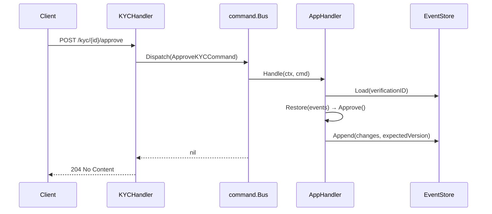

# KYC Service HTTP Interface

**Source:** `kyc-service/internal/interfaces/http/`

## Endpoints

### Health

| Method | Path | Description |
|--------|------|-------------|
| `GET` | `/health` | Returns service health status |

### KYC Verification

| Method | Path | Handler | Description |
|--------|------|---------|-------------|
| `POST` | `/kyc` | `KYCHandler.Submit` | Submit a new KYC verification |
| `POST` | `/kyc/{id}/approve` | `KYCHandler.Approve` | Approve verification (operator) |
| `POST` | `/kyc/{id}/reject` | `KYCHandler.Reject` | Reject verification (operator) |
| `GET` | `/kyc/{id}` | `KYCHandler.GetStatus` | Get current verification status |

#### POST /kyc

Request:
```json
{ "customer_id": "cust-123" }
```

Response `201 Created`:
```json
{ "verification_id": "a1b2c3d4-..." }
```

#### POST /kyc/{id}/approve

No request body. Response `204 No Content`.

#### POST /kyc/{id}/reject

Request:
```json
{ "reason": "Document expired" }
```

Response `204 No Content`.

#### GET /kyc/{id}

Response `200 OK`:
```json
{
  "verification_id": "a1b2c3d4-...",
  "customer_id": "cust-123",
  "status": "Verified"
}
```

On rejection:
```json
{
  "verification_id": "a1b2c3d4-...",
  "customer_id": "cust-123",
  "status": "Rejected",
  "reason": "Document expired"
}
```

### Error Responses

| Status | Condition |
|--------|-----------|
| `400 Bad Request` | Malformed JSON body |
| `404 Not Found` | Verification does not exist |
| `422 Unprocessable Entity` | Business rule violation (wrong status, already approved/rejected) |
| `500 Internal Server Error` | Unexpected server error |

```json
{ "message": "kyc: verification is already verified" }
```

## HTTP → Application Flow



## See Also

- [KYC Domain](../domain/kyc.md)
- [PLAN-005](../plans/plan-005-kyc-service.md)
- [PLAN-006](../plans/plan-006-event-driven-integration.md) — Kafka publishing after approve/reject
