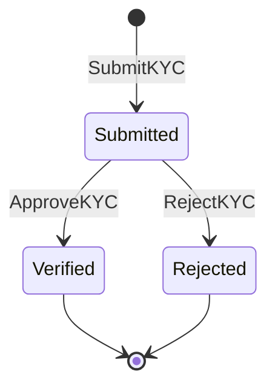

# PLAN-005: KYC Service — Domain Implementation

| | |
|-|-|
| **Status** | Completed |
| **Date** | 2026-04-13 |
| **Depends on** | [PLAN-002](plan-002-monorepo-restructure.md), [PLAN-003](plan-003-contracts-module.md) |

## Goal

Implement the KYC bounded context as an independent microservice.
Handles identity verification lifecycle for customers.
Publishes events consumed by `wallet-service` to activate or freeze accounts.

## Aggregate: KYCVerification

### Commands
- `SubmitKYC` — customer submits identity documents
- `ApproveKYC` — operator approves the verification
- `RejectKYC` — operator rejects the verification

### Domain Events
- `KYCSubmitted`
- `KYCVerified`
- `KYCRejected`

### Status State Machine

### Business Rules
- Only `Submitted` verification can be approved or rejected
- Once verified or rejected, status is final (no transitions out)
- One KYC verification per customer at a time

## Read Models (Projections)

- **KYC Status** — current verification status per customer

## HTTP Endpoints

- `POST /kyc` — submit KYC for a customer
- `POST /kyc/{id}/approve` — approve verification (operator)
- `POST /kyc/{id}/reject` — reject verification (operator)
- `GET /kyc/{id}` — get current KYC status

## Acceptance Criteria

- [x] `POST /kyc` creates a verification in `Submitted` status — verified via `GET /kyc/{id}`
- [x] `POST /kyc/{id}/approve` transitions status to `Verified`
- [x] `POST /kyc/{id}/reject` transitions status to `Rejected`
- [x] Approving an already `Verified` verification returns an error
- [x] Rejecting an already `Rejected` verification returns an error
- [ ] `KYCVerified` event is published to Kafka after approval (verified in integration test) — deferred to PLAN-006
- [ ] `KYCRejected` event is published to Kafka after rejection (verified in integration test) — deferred to PLAN-006
- [x] All KYC state is fully reconstructible by replaying events from the event store

## Tasks

- [x] `KYCVerification` aggregate with all commands and events
- [x] `KYCStatus` value object (`Submitted`, `Verified`, `Rejected`)
- [x] Command handlers
- [x] In-memory event store implementation
- [x] KYC status projection (query handler)
- [x] HTTP handlers and router wiring
- [x] uber/fx module for KYC domain
- [ ] Publish `KYCVerified` / `KYCRejected` to message broker (see [PLAN-006](plan-006-event-driven-integration.md))
- [x] Update docs
