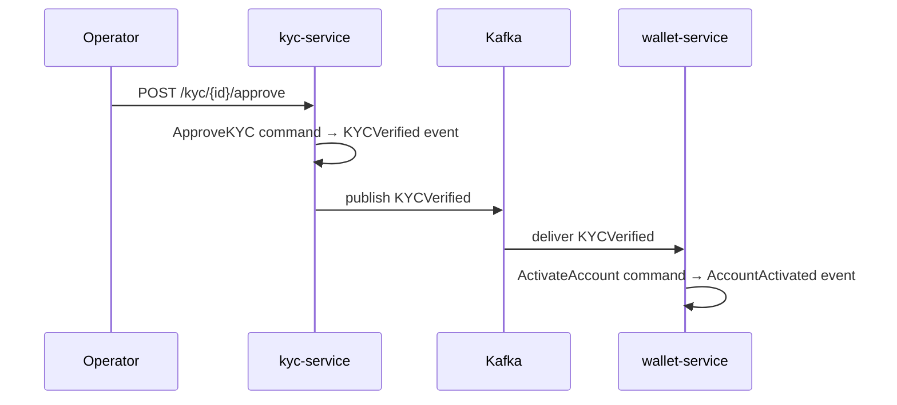

# PLAN-006: Event-Driven Integration Between Services

| | |
|-|-|
| **Status** | Not Started |
| **Date** | 2026-04-13 |
| **Depends on** | [PLAN-004](plan-004-wallet-service.md), [PLAN-005](plan-005-kyc-service.md) |

## Goal

Wire `kyc-service` and `wallet-service` together via async event-driven communication.
`kyc-service` publishes domain events; `wallet-service` subscribes and reacts.

## Message Broker

**Kafka** — industry standard for event-driven microservices.
Run locally via Docker Compose (KRaft mode, no Zookeeper needed since Kafka 3.x).

## Event Flow

## Acceptance Criteria

- [ ] `docker-compose up` starts both services + Kafka without errors
- [ ] After KYC approval: `wallet-service` account transitions to `Active` without any direct API call
- [ ] After KYC rejection: `wallet-service` account transitions to `Frozen` without any direct API call
- [ ] Restarting `wallet-service` mid-flow does not lose the pending KYC event (Kafka consumer group offset)
- [ ] Full end-to-end flow works: open account → submit KYC → approve → withdraw money

## Tasks

- [ ] Add Kafka to local dev setup (Docker Compose)
- [ ] `kyc-service`: publisher — on `KYCVerified` / `KYCRejected` publish to Kafka topic
- [ ] `wallet-service`: subscriber — consume KYC events, dispatch `ActivateAccount` / `FreezeAccount` commands
- [ ] Define topic names as constants in `contracts/`
- [ ] Handle at-least-once delivery (idempotent command handlers)
- [ ] `docker-compose.yml` at repo root — runs Kafka + both services
- [ ] Update docs: integration flow diagram
