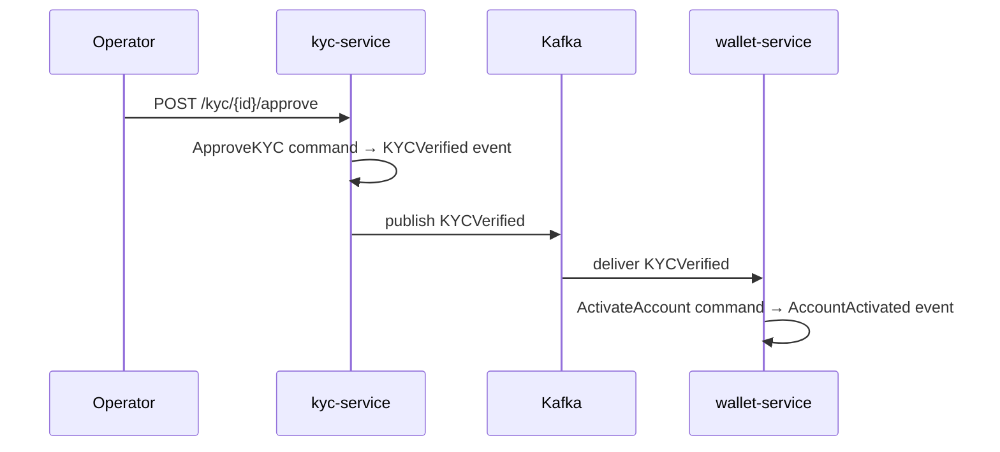

# PLAN-006: Event-Driven Integration Between Services

| | |
|-|-|
| **Status** | DONE |
| **Date** | 2026-04-13 |
| **Depends on** | [PLAN-004](plan-004-wallet-service.md), [PLAN-005](plan-005-kyc-service.md) |

## Goal

Wire `kyc-service` and `wallet-service` together via async event-driven communication.
`kyc-service` publishes domain events; `wallet-service` subscribes and reacts.

## Message Broker

**Kafka** — industry standard for event-driven microservices.
Run locally via Docker Compose (KRaft mode, no Zookeeper needed since Kafka 3.x).

## Event Flow

## Acceptance Criteria

- [ ] `docker-compose up` starts both services + Kafka without errors
- [ ] After KYC approval: `wallet-service` account transitions to `Active` without any direct API call
- [ ] After KYC rejection: `wallet-service` account transitions to `Frozen` without any direct API call
- [ ] Restarting `wallet-service` mid-flow does not lose the pending KYC event (Kafka consumer group offset)
- [ ] Full end-to-end flow works: open account → submit KYC → approve → withdraw money

## Tasks

- [x] Add Kafka to local dev setup (Docker Compose — KRaft, dual-listener)
- [x] `kyc-service`: publisher — on `KYCVerified` / `KYCRejected` publish to Kafka topic
- [x] `wallet-service`: subscriber — consume KYC events, dispatch `ActivateAccount` / `FreezeAccount` commands
- [x] Define topic names as constants in `contracts/`
- [x] Handle at-least-once delivery (idempotent command handlers, `ErrNotPending` = skip)
- [x] `docker-compose.yml` at repo root — runs Kafka + both services
- [x] Update docs: `docs/infrastructure/kafka.md`

## Implementation Notes

See [`docs/infrastructure/kafka.md`](../infrastructure/kafka.md) for the complete architecture.

### Dual-write trade-off

The ApproveKYC / RejectKYC command handlers append to the event store **then** publish to Kafka. If Kafka publish fails after a successful event store append, the domain state is committed but the wallet service won't be notified. This is acceptable for a learning project. Production fix: **outbox pattern** — write the integration event to a DB table in the same transaction, then relay it to Kafka asynchronously.
