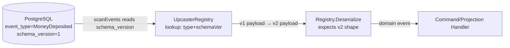

# PLAN-009: Event Schema Versioning (Upcasting)

| | |
|-|-|
| **Status** | DONE |
| **Date** | 2026-04-13 |
| **Revised** | 2026-04-15 |
| **Depends on** | [PLAN-007](plan-007-postgresql-event-store.md) |

## Goal

Ensure domain events stored in PostgreSQL are readable after schema changes — without rewriting old rows.

> **Scope reduction vs. original draft:** saga/process-manager versioning was removed. No saga
> infrastructure exists yet; versioning it is premature. That concern is deferred to a future plan
> once saga infrastructure is built.

## Problem

When an event struct changes (new field, renamed field, removed field), old rows in the `events`
table still hold the old JSONB shape. New code that tries to deserialize them either panics, returns
zero-value fields, or ignores data it should not.

**Upcasting** solves this: at read time, a transform function converts the old payload into the new
shape before the domain object is constructed.

## Naming Clarification

Two distinct version concepts exist in the codebase — do not confuse them:

| Field | Lives in | Meaning |
|---|---|---|
| `event_version` | `events` table, `Base.version` | Position in aggregate stream. Used for optimistic concurrency. |
| `schema_version` | `events` table (to be added) | Version of the JSONB payload shape. Used for upcasting. |

## Architecture



Upcaster sits **between** DB scan and Registry deserialization. Registry always operates on the
latest payload shape. Upcasters handle the gap.

## Integration Points in Current Code

### 1. Migration — add `schema_version` column

`wallet-service/db/migrations/001_create_events.sql` (or a new `004_add_schema_version.sql`):

```sql
ALTER TABLE events ADD COLUMN schema_version INT NOT NULL DEFAULT 1;
```

New events written by current code should insert `schema_version = 1`.

### 2. `Append` in `postgres.go`

`PostgresEventStore.Append` INSERT must include the `schema_version` of the event being saved. 
To avoid hardcoding, the event store should obtain the current schema version for the `eventType` dynamically (e.g., from the `Registry` via `GetVersion(eventType)` or from the event itself).

```go
// currentVer := registry.GetLatestVersion(eventType)
INSERT INTO events (..., schema_version) VALUES (..., currentVer)
```

### 3. `scanEvents` in `postgres.go`

`Load` SELECT must include `schema_version`. The scanned value is passed to the upcaster before
deserialization:

```go
// current SELECT (missing schema_version):
SELECT aggregate_id::text, aggregate_type, event_type, event_version, payload, occurred_at

// updated SELECT:
SELECT aggregate_id::text, aggregate_type, event_type, event_version, schema_version, payload, occurred_at
```

### 4. `UpcasterRegistry` — new type

```go
// UpcastFunc transforms a v(n) payload into a v(n+1) payload.
type UpcastFunc func(payload []byte) ([]byte, error)

type UpcasterRegistry struct {
    // key: (eventType, fromSchemaVersion)
    upcasters map[upcasterKey]UpcastFunc
}

type upcasterKey struct {
    eventType     string
    schemaVersion int
}

// Upcast applies upcasters in a chain starting from schemaVersion.
// It iterates until no further upcaster is found for (eventType, currentVer).
func (r *UpcasterRegistry) Upcast(eventType string, schemaVersion int, payload []byte) ([]byte, error)
```

### 5. `Registry.Deserialize` — unchanged

Registry always deserializes the **latest** payload shape. Upcasting happens before this call,
transparently.

### 6. `InMemoryEventStore` — not affected

In-memory store holds live `DomainEvent` objects, not raw bytes. Upcasting is a
serialization-layer concern; `InMemoryEventStore` is unaffected.

## Acceptance Criteria

- [ ] Old V1 `MoneyDeposited` row in DB is readable after V2 schema is deployed — correct field values, no panic
- [ ] Missing fields in old events get declared defaults, not Go zero-value surprises
- [ ] Correct dynamic `schema_version` is written for all new events
- [ ] `UpcasterRegistry` with `Upcast(eventType, schemaVersion, payload)` API implemented
- [ ] Upcaster registry covers one real schema migration as working example (e.g. `MoneyDeposited` v1→v2 adding `Description` field with default `""`)
- [ ] Integration test: insert raw v1 JSON row into DB, load aggregate, assert v2 field present with correct default

## Tasks

- [x] Migration `004_add_schema_version.sql` — add `schema_version INT NOT NULL DEFAULT 1` to `events`
- [x] Add `GetLatestVersion(eventType string) int` to `Registry` (returns 1 by default)
- [x] Update `Append` in `postgres.go` — get version from `Registry` and insert as `schema_version`
- [x] Update `Load` SELECT + `scanEvents` — read `schema_version`, pass to upcaster before deserialize
- [x] Define `UpcasterRegistry` with `Register(eventType, fromVersion, UpcastFunc)` and `Upcast(...)`
- [x] Wire `UpcasterRegistry` into `PostgresEventStore` (inject alongside `Registry`)
- [x] Implement example upcaster: `MoneyDeposited` v1→v2 (add `Description string`, default `""`)
- [x] Integration test: raw v1 row → Load → assert v2 field with default
- [x] Update docs
