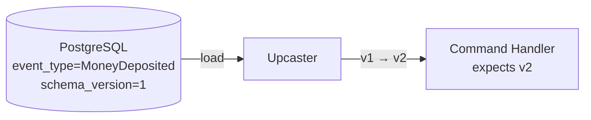
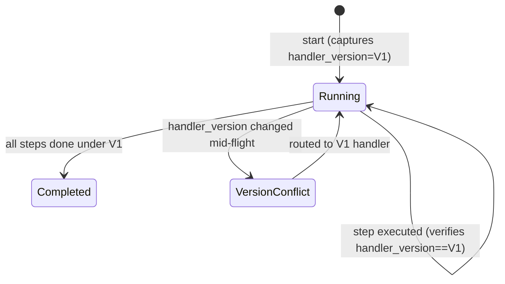

# PLAN-009: Event Versioning and Schema Evolution

| | |
|-|-|
| **Status** | Not Started |
| **Date** | 2026-04-13 |
| **Depends on** | [PLAN-007](plan-007-postgresql-event-store.md) |

## Goal

Ensure that domain events and sagas/process managers are versioned and immutable end-to-end.

Two problems to solve:

1. **Event schema evolution** — an event struct changes over time (new fields, renamed fields).
   Old events stored in PostgreSQL must still be readable with new code.

2. **Pipeline/saga versioning** — a saga that starts under handler version V1 must complete
   under V1, even if V2 is deployed mid-flight. A saga cannot start as one shape and finish as another.

## Event Schema Evolution (Upcasting)

When an event's schema changes, old events in the store are not re-written.
Instead, an **upcaster** transforms the old payload into the new shape at read time.

Each event type carries a `schema_version` field in the DB.
An upcaster registry maps `(event_type, schema_version)` → transform function.

## Pipeline / Saga Versioning

A saga persists its own version at the time it was created.
When a handler step is invoked, it checks: "is my handler version compatible with this saga's version?"

- If yes → proceed normally
- If no → route to the handler version that matches the saga's start version

This prevents a saga from starting with 3 steps and finishing with 5 steps
because new steps were deployed mid-flight.

## Acceptance Criteria

- [ ] Old V1 events stored in DB are readable after V2 schema is deployed — no panic, correct field values
- [ ] Missing fields in old events get sensible defaults, not zero-value surprises
- [ ] A saga started under handler V1 completes under V1 even after V2 is deployed
- [ ] A saga started under handler V1 does NOT silently execute V2 steps mid-flight
- [ ] Integration test demonstrates version conflict detection with a real PostgreSQL + real saga state
- [ ] Upcaster registry covers at least one real schema migration as a working example

## Tasks

- [ ] Add `schema_version` column to `events` table
- [ ] Define `Upcaster` interface and `UpcasterRegistry`
- [ ] Implement upcasters for first schema-changed event (as a working example)
- [ ] Add `handler_version` to saga/process manager state
- [ ] Implement version check in saga step execution
- [ ] Integration test: deploy V1, start saga, deploy V2, verify saga completes under V1
- [ ] Integration test: old V1 event read correctly with V2 upcaster
- [ ] Update docs
